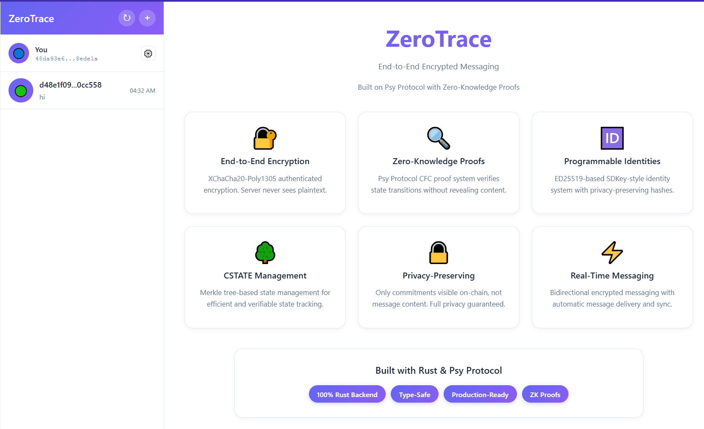
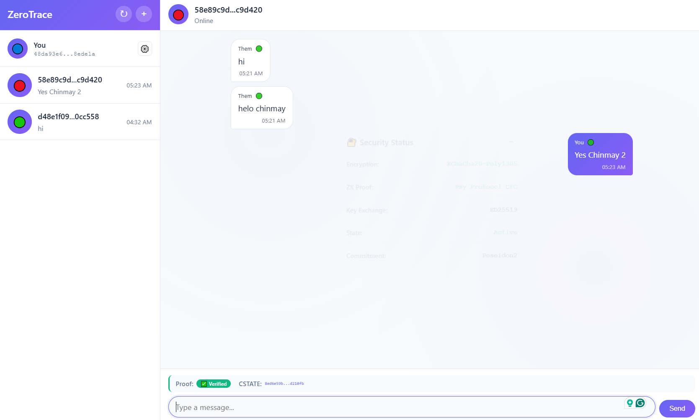
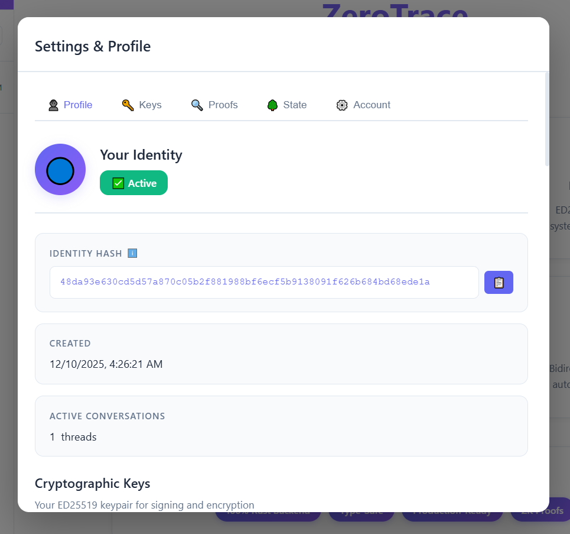

# ZeroTrace: End-to-End Encrypted Messaging DApp

**Leveraging Psy Protocol's zero-knowledge proofs for decentralized messaging with absolute privacy.**

> **Note:** This project is an MVP prototype. ZK proof generation and Poseidon2 hashing are simulated with drop-in replacements ready for production Psy Protocol integration.


_ZeroTrace main interface - Clean, modern messaging UI with identity management_

---

## 🚀 Installation & Setup

### Prerequisites

- **Rust** (latest stable version) - [Install Rust](https://www.rust-lang.org/tools/install)
- Modern web browser (Chrome, Firefox, Edge)

### Clone & Install

```bash
# Clone the repository
git clone https://github.com/0xali3n/psy
cd psy

# Build the project
cargo build

# Run the server
cargo run --bin server
```

Open browser: **http://127.0.0.1:8080**


_Server running on http://127.0.0.1:8080 - Actix-web backend with API endpoints_

### Quick Demo

#### Step 1: Create Identity


_Creating a new ED25519 identity - Identity hash and public key generated_

1. **Browser A:** Create identity, copy hash

#### Step 2: Connect Users


_Connecting two users via QR code or identity hash - Secure peer-to-peer connection_

2. **Browser B:** Create identity, connect using Browser A's hash

#### Step 3: Send Encrypted Messages


_End-to-end encrypted messaging with ZK proof status indicators_

3. **Send Message:** Type message, verify ZK proof status
4. **Verify:** Check console (F12) and server terminal

#### Step 4: View Settings & Technical Details


_User settings and technical details - Identity keys, CSTATE root, and proof information_

## ✅ How This Meets Hackathon Requirements

✔ **Built in Rust** - Full backend in Rust (Actix-web, Tokio) with type-safe, high-performance code

✔ **Implements Psy Concepts** - Identity (SDKey-style ED25519), CSTATE (Merkle tree state), Commitments (Poseidon2-style), CFC proofs (Psy Protocol format)

✔ **Scalable Architecture** - Stateless server design; server instances can horizontally scale behind a load balancer. Merkle tree state enables efficient sync.

✔ **Privacy-by-Design** - E2E encryption (XChaCha20-Poly1305) + ZK-style state transitions. Server never sees plaintext.

✔ **Clear Migration Path** - Trait-based architecture ready for Psy Protocol testnet integration (plonky2-hwa, Realm, UCON, DA Miner)

---

## 🏗️ Architecture

```
┌─────────────────────────────────────────────────────────────┐
│                    ZeroTrace Architecture                    │
├─────────────────────────────────────────────────────────────┤
│                                                             │
│  ┌──────────────┐         ┌──────────────┐                │
│  │   Frontend   │────────▶│  API Server  │                │
│  │  (Browser)   │  HTTP   │  (Actix-web) │                │
│  │              │         │   Tokio      │                │
│  └──────────────┘         └──────┬───────┘                │
│                                   │                         │
│                          ┌────────┴────────┐               │
│                          ▼                 ▼               │
│                   ┌──────────┐      ┌──────────┐          │
│                   │  Message │      │ Identity │          │
│                   │  Store   │      │ Manager  │          │
│                   └──────────┘      └──────────┘          │
│                                                             │
│  Core Services:                                             │
│  ┌──────────────┐  ┌──────────────┐  ┌──────────────┐    │
│  │  Encryption  │  │  Commitments │  │  ZK Proofs   │    │
│  │ (XChaCha20)  │  │  (Poseidon2) │  │  (CFC)       │    │
│  └──────────────┘  └──────────────┘  └──────────────┘    │
│                                                             │
└─────────────────────────────────────────────────────────────┘
```

### Message Workflow

```
Client: Encrypt → Compute Commitment → Send
                ↓
Server: Get CSTATE → Generate CFC Proof (simulated) → Verify → Create EndCap → Update State
                ↓
Client: Poll → Decrypt → Display
```

---

## 🔐 Security Features

- **E2E Encryption:** XChaCha20-Poly1305 (server never sees plaintext)
- **ZK Proofs:** Psy Protocol CFC proofs verify state transitions (simulated, ready for plonky2-hwa)
- **Identity System:** ED25519 keypairs with privacy-preserving hashes. Server stores only public keys. Private keys remain in browser localStorage.
- **Replay Protection:** VAA nonces per identity
- **Commitments:** Only hashes stored, plaintext off-chain

### Cryptographic Primitives

- **Encryption:** XChaCha20-Poly1305 (256-bit key, 192-bit nonce)
- **Signatures:** ED25519 (Ed25519-SHA512)
- **Hashing:** SHA-256, Keccak256 (Poseidon2-style placeholder for MVP)
- **ZK Proofs:** CFC proofs (plonky2-hwa ready, currently simulated)

---

## 📡 API Endpoints

| Method | Endpoint                   | Description                          |
| ------ | -------------------------- | ------------------------------------ |
| `POST` | `/identity/create`         | Create ED25519 identity              |
| `POST` | `/send`                    | Send encrypted message with ZK proof |
| `GET`  | `/read/{thread_id}`        | Get decrypted messages               |
| `GET`  | `/cstate/{identity_hash}`  | Get CSTATE root                      |
| `GET`  | `/threads/{identity_hash}` | Get all threads                      |
| `GET`  | `/health`                  | Check server status                  |

---

## 📊 Data Model

### Message

```rust
struct Message {
    thread_id: String,              // "hash1:hash2" (sorted)
    sender_id: String,              // Identity hash
    ciphertext: String,             // Base64 encrypted
    iv: String,                     // Base64 nonce
    timestamp: u64,
    message_commitment: String,     // Poseidon2-style commitment
    endcap: Option<EndCap>,         // ZK proof + metadata
}
```

### CSTATE (Contract State)

Merkle tree of user's message state. Root = CSTATE root (updated on each message). Leaves = thread roots (one per conversation).

### Identity System

- **Keypair:** ED25519 (32-byte public key)
- **Identity Hash:** `SHA256("zerotrace_identity" || public_key)`
- **Privacy:** Identity hash used instead of public key

---

## 🔄 Psy Protocol Integration

### Current Status

- ✅ Identity system (ED25519)
- ✅ Encryption (XChaCha20-Poly1305)
- ✅ Commitments (Poseidon2-style, SHA-256 placeholder for MVP)
- ✅ ZK proof structure (CFC format)
- 🚧 Real plonky2-hwa integration (simulated, drop-in replaceable)
- 🚧 On-chain submission (format ready, Realm integration planned)

### Integration Points

```
┌─────────────────────────────────────────────────────────────┐
│  Psy Protocol Components                                    │
├─────────────────────────────────────────────────────────────┤
│  Realm    → Submit EndCaps (simulated EndCap generation)   │
│  UCON     → Store CSTATE roots per identity                │
│  CLEAF    → Whitelist of allowed CFCs                      │
│  DA Miner → Store encrypted message blobs                  │
│  Indexer  → Index messages, handle reorgs                  │
└─────────────────────────────────────────────────────────────┘
```

### Migration Path

- **SimProver → Plonky2Prover:** Trait-based, drop-in replacement
- **SHA-256 → Poseidon2:** Trait-based hashing, ready to swap
- **In-memory → Database:** Architecture supports sled/Postgres

---

## 🗺️ Roadmap & Future Plans

### Short-term (Next Sprint)

- [ ] Real plonky2-hwa integration for ZK proofs
- [ ] Database persistence (sled or Postgres)
- [ ] WebSocket support for real-time messaging
- [ ] Real Poseidon2 hash implementation

### Medium-term

- [ ] Psy Protocol testnet integration
- [ ] Simulated EndCap generation (Realm integration planned)
- [ ] DA Miner integration for blob storage
- [ ] Indexer for message querying
- [ ] Multi-device state sync

### Long-term

- [ ] Group chat support (multi-party encryption)
- [ ] Perfect Forward Secrecy (Double Ratchet)
- [ ] Message reactions and read receipts
- [ ] Push notifications
- [ ] Mobile app (Rust core + native UI)

---

## ❓ FAQ for Judges

**Q: How does this integrate with Psy Protocol?**  
A: The proof system uses `CFCProof::for_send_message()` which generates proofs in Psy Protocol format. EndCap structure matches Psy Protocol spec. Ready for integration when plonky2-hwa is available.

**Q: What about persistence?**  
A: Currently in-memory for demo. Architecture supports easy swap to sled (embedded) or Postgres. All storage is abstracted through `MessageStore`.

**Q: How do you handle key management?**  
A: Private keys never leave client (in production). Server only stores public keys. Identity hash derived from public key using SHA-256.

**Q: What's the scalability plan?**  
A: Stateless API design allows horizontal scaling. Merkle tree state enables efficient sync. WebSocket ready for real-time (currently using polling).

**Q: What makes this production-ready?**  
A: Type-safe Rust code, proper error handling, thread-safe operations, authenticated encryption, replay protection, and extensible architecture.

**Q: What's simulated vs real?**  
A: **Real:** E2E encryption, ED25519 identities, commitments, CSTATE management. **Simulated:** ZK proof generation (ready for plonky2-hwa), Poseidon2 hashing (uses SHA-256 placeholder).

---

**Built with Rust and Psy Protocol**
